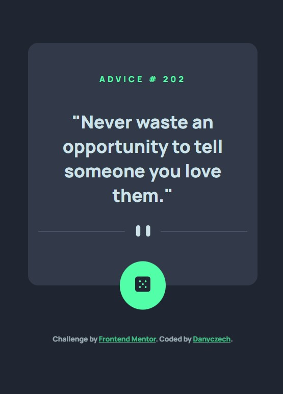
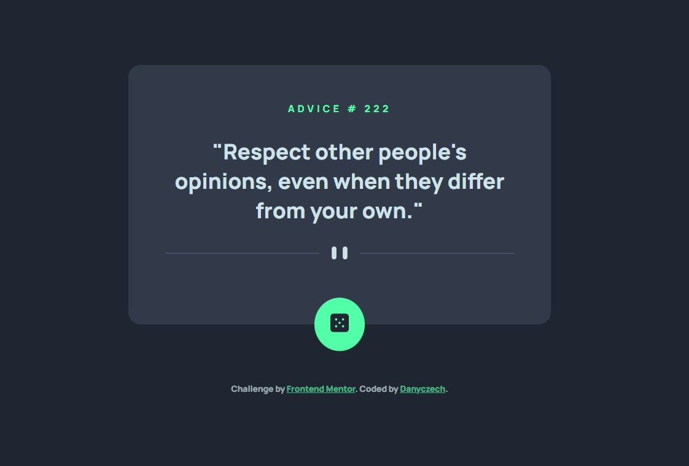

# Frontend Mentor - Advice generator app solution

This is a solution to the [Advice generator app challenge on Frontend Mentor](https://www.frontendmentor.io/challenges/advice-generator-app-QdUG-13db). Frontend Mentor challenges help you improve your coding skills by building realistic projects.

## Table of contents

- [Overview](#overview)
  - [The challenge](#the-challenge)
  - [Screenshot](#screenshot)
  - [Links](#links)
- [My process](#my-process)
  - [Built with](#built-with)
  - [What I learned](#what-i-learned)
  - [Continued development](#continued-development)
- [Author](#author)

## Overview

### The challenge

Users should be able to:

- View the optimal layout for the app depending on their device's screen size
- See hover states for all interactive elements on the page
- Generate a new piece of advice by clicking the dice icon

### Screenshot




### Links

- Solution URL: [https://danyczech.github.io/advice-generator-app/](https://danyczech.github.io/advice-generator-app/)

## My process

### Built with

- Semantic HTML5 markup
- Vanilla JavaScript
- CSS custom properties
- Flexbox
- Sass
- Mobile-first workflow

### What I learned

Nice recap how to work with API.

```js
const getAdvice = function () {
  fetch("https://api.adviceslip.com/advice")
    .then((response) => response.json())
    .then((data) => {
      renderAdvice(data.slip);
    })
    .catch((err) => {
      adviceNumber.textContent = `&#10041;`;
      adviceText.textContent = `"Computer is tired (for more details read console). It is high time for a break :-)."`;
      console.log(err);
    });
};
```

### Continued development

Maybe I'll rewrite it to React component...

## Author

- LinkedIn - [Danyczech](https://www.linkedin.com/in/danyczech/)
- Frontend Mentor - [@danyczech](https://www.frontendmentor.io/profile/danyczech)
